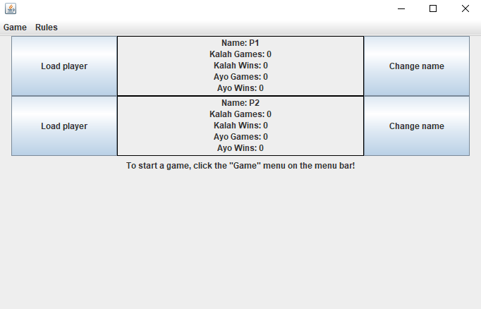
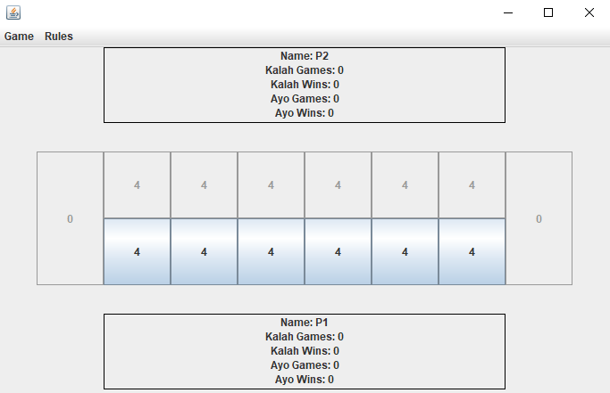

# Mancala

A fully-functioning Mancala game packaged with a GUI and built with object-oriented programming paradigms in mind!

## Description

Provides extensive classes and exceptions to the user visible in the following directories:
- [Mancala](src/main/java/mancala)
- [UI](src/main/java/ui)

Supports saving and loading of game state and player state!

## Getting Started

### Dependencies

- Java
- Gradle
- JUnit (for unit-testing)

### Executing program

**NOTE: These commands must be ran in the same directory as this file**

- First, build the program by running `gradle build`
- Then, run the program by running `java -jar build/libs/Mancala.jar`

A full implementation of the game (GUI) is already available and packaged to the user.

## Acknowledgments

[Java documentation](https://docs.oracle.com/en/java/javase/17/docs/api/index.html)

[Java Swing documentation](https://docs.oracle.com/javase%2F7%2Fdocs%2Fapi%2F%2F/javax/swing/package-summary.html)

[Mancala documentation](https://www.officialgamerules.org/mancala)

## Screenshots

